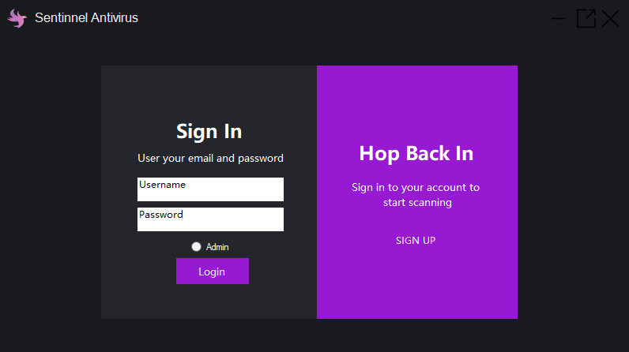
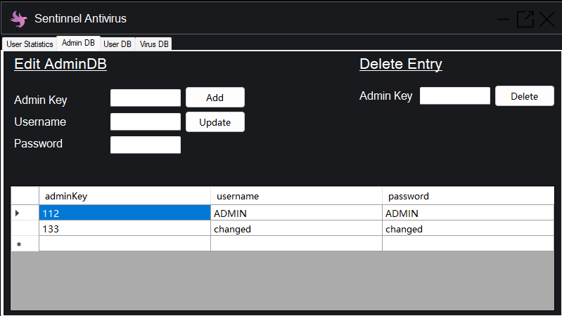
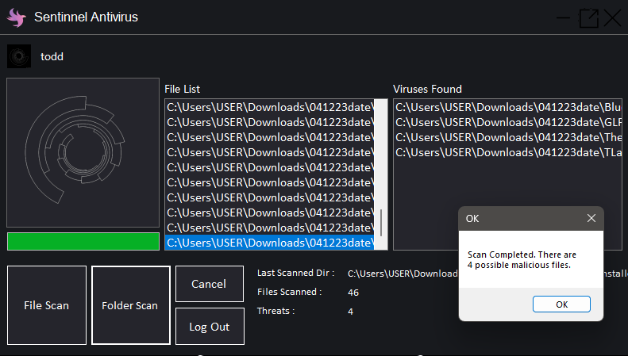
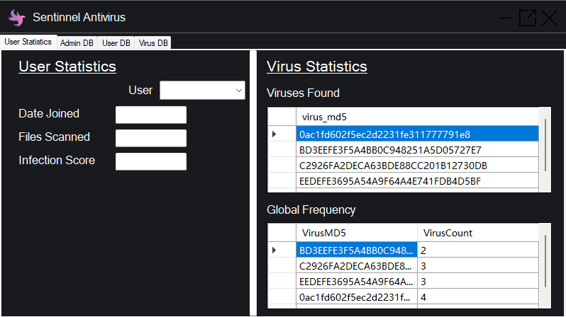
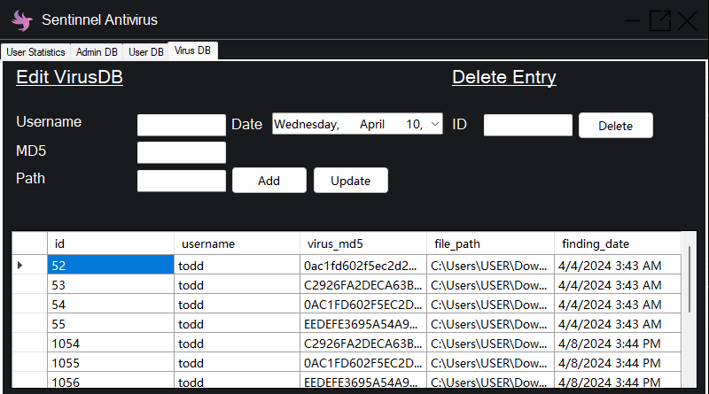
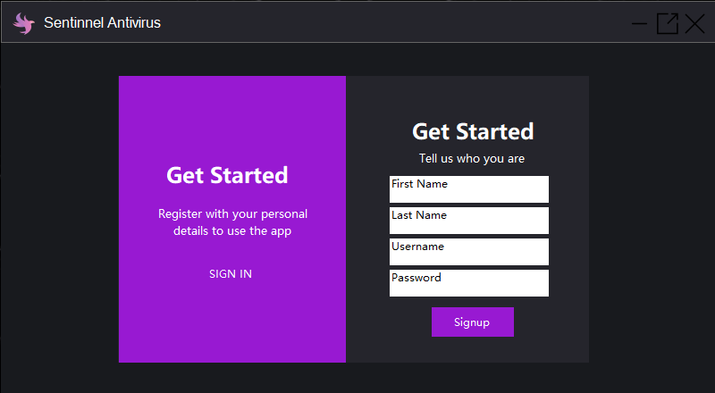

# Sentinnel


## Table of Contents
- [Overview](#overview)
- [Features](#features)
- [Screenshots](#screenshots)
- [System Architecture](#system-architecture)
- [Database Schema](#database-schema)
- [Installation & Setup](#installation--setup)
- [Usage](#usage)
- [Project Structure](#project-structure)
- [Contributing](#contributing)
- [License](#license)
- [Contact](#contact)

---

## Overview
**Sentinnel** is a Windows Forms application built with VB.NET for managing and monitoring users, administrators, and virus scan data. It provides a user-friendly interface for scanning files/folders for viruses (using MD5 hash matching), managing user/admin accounts, and visualizing scan statistics. The application is backed by a local SQL database and is suitable for educational, demonstration, or small-scale enterprise use.

---

## Features
- **User Authentication:** Secure login for users and administrators.
- **Admin Dashboard:** Manage users, admins, and view scan/virus statistics.
- **User Management:** Add, update, and delete user accounts.
- **Virus Scanning:** Scan files and folders, check against a known MD5 hash list.
- **Scan Logging:** Record scan results and virus findings in the database.
- **Statistics:** Visualize user activity, scan counts, and infection rates.
- **Modern UI:** Intuitive Windows Forms interface with custom graphics and animations.

---

## Screenshots
| Login | Admin Dashboard | Scan Page |
|-------|----------------|-----------|
|  |  |  |

| User Stats | Virus DB | Signup |
|------------|----------|--------|
|  |  |  |

---

## System Architecture
- **Frontend:** Windows Forms (VB.NET)
- **Backend:** Local SQL Server (MSSQLLocalDB)
- **Database:** `SentinnelDB.mdf` (AdminDB, UserDB, VirusDB, ScanData, VirusFinding tables)
- **Resources:** Custom icons, GIFs, and images for UI/UX

---

## Database Schema
**Main Tables:**
- **AdminDB:** `adminKey (int, PK)`, `username (nvarchar)`, `password (nvarchar)`
- **UserDB:** `username (nvarchar, PK)`, `password (nvarchar)`, `joindate (nvarchar)`, `firstname (nvarchar)`, `lastname (nvarchar)`, `filesScanned (int)`, `virusFrequency (int)`
- **VirusDB:** `md5 (int, PK)`, `virusname (nvarchar)`, `totalfrequency (int)`
- **ScanData:** `username (nvarchar)`, `scan_date (datetime)`, `files_scanned (int)`
- **VirusFinding:** `id (int, PK)`, `username (nvarchar)`, `virus_md5 (nvarchar)`, `file_path (nvarchar)`, `finding_date (datetime)`

---

## Installation & Setup
1. **Requirements:**
   - Windows 10+
   - .NET Framework 4.7.2+
   - Visual Studio (recommended for development)
   - LocalDB (MSSQLLocalDB)

2. **Clone the Repository:**
   ```sh
   git clone <your-repo-url>
   cd Sentinnel
   ```

3. **Database Setup:**
   - The database file `SentinnelDB.mdf` should be attached automatically via the connection string in `App.config`.
   - If needed, attach the database manually in SQL Server Management Studio.

4. **Build & Run:**
   - Open `Sentinnel.sln` in Visual Studio.
   - Restore NuGet packages if prompted.
   - Build and run the solution.

---

## Usage
- **Login:** Start the application and log in as a user or admin.
- **Admin Functions:**
  - Manage users and admins (add, update, delete)
  - View scan and infection statistics
- **User Functions:**
  - Scan files or folders for viruses
  - View personal scan history and infection stats
- **Virus Scanning:**
  - Select files/folders to scan
  - Results are checked against a known MD5 list (`list.txt`)
  - Infections are logged in the database

---

## Project Structure
```
Sentinnel/
  ├── AdminPage.vb           # Admin dashboard logic
  ├── Form1.vb               # Main user scan interface
  ├── Homepage.vb            # Login and navigation
  ├── SignUp.vb              # User registration
  ├── Resources/             # Images, icons, GIFs
  ├── SentinnelDBDataSet.*   # Database schema and designer files
  ├── App.config             # Connection strings and settings
  ├── ...
```

---

## Contributing
Contributions are welcome! Please open issues or submit pull requests for improvements, bug fixes, or new features.

---

## License
This project is for educational and demonstration purposes. For other uses, please contact the author.

---